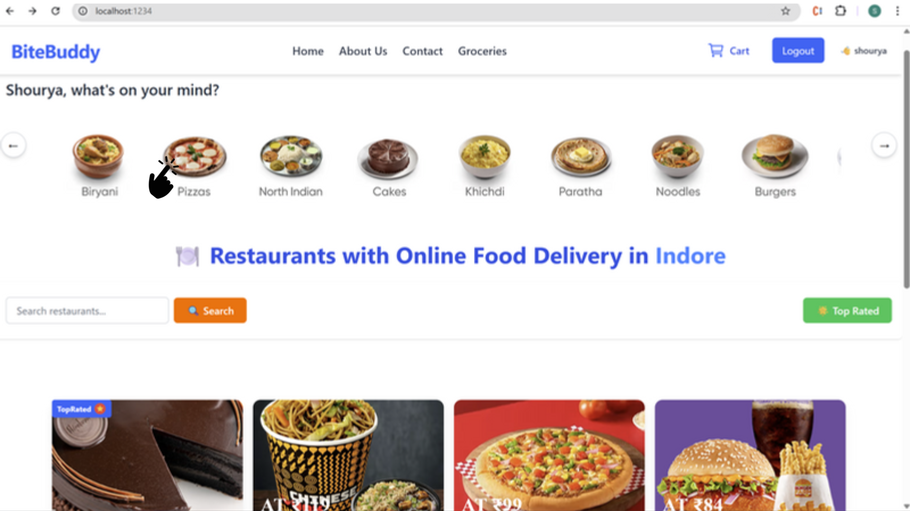
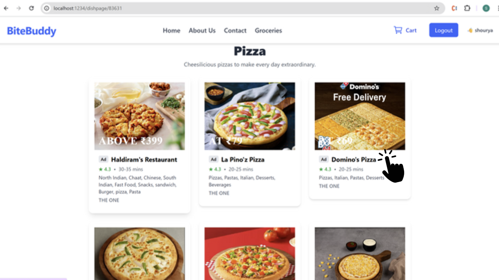
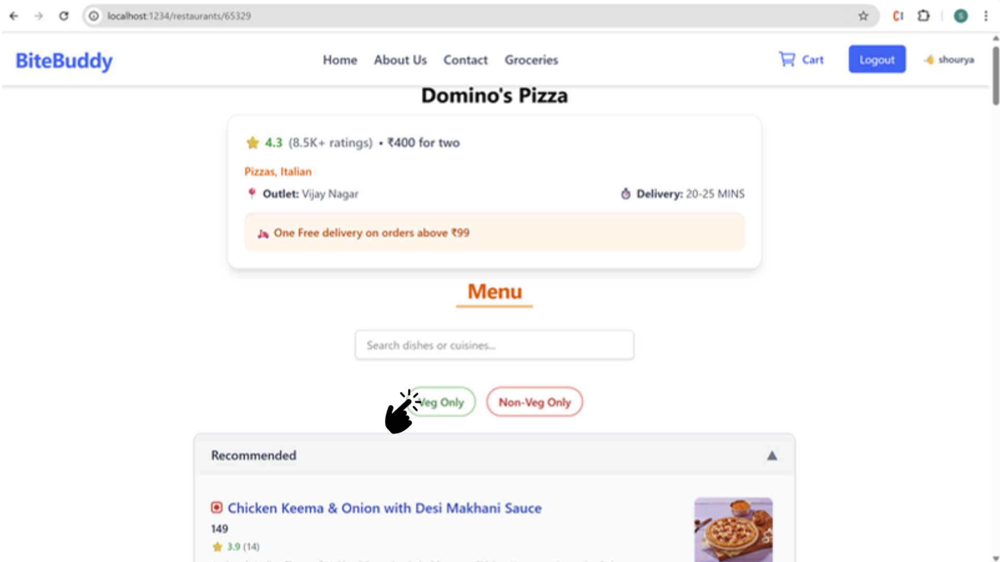
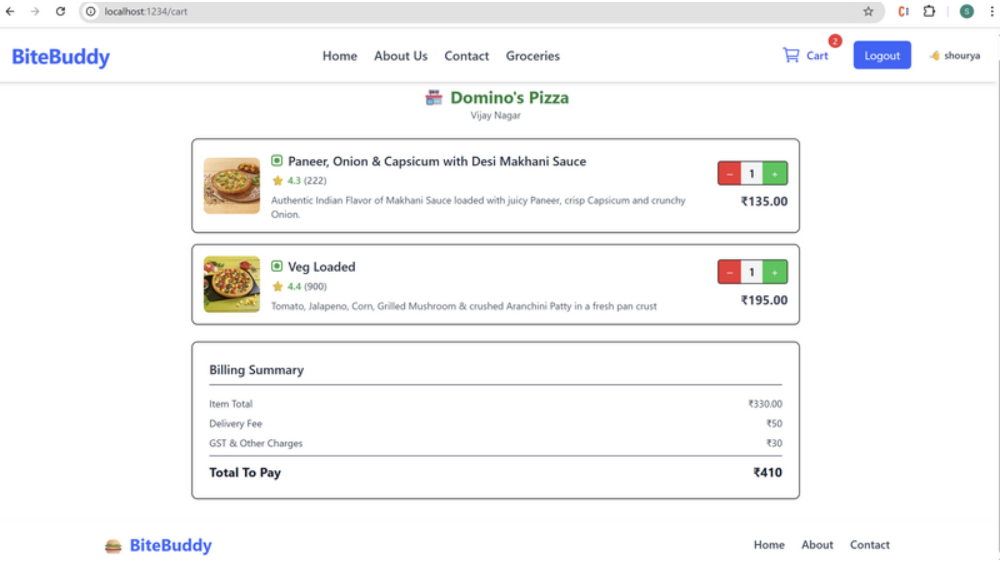

# 🍽️ Swiggy Frontend Clone – Real-Time Restaurant App (React + Redux)

This is a fully functional, industry-level **Swiggy frontend clone** built with **React.js**. It fetches **live restaurant and menu data** from real Swiggy APIs, demonstrating my ability to build modern, scalable, and production-grade frontend applications.

---

## 🚀 Features

- ⚡ **Live Data Integration**: Dynamically fetches real-time restaurant and menu data from Swiggy's public APIs.
- 🧭 **Dynamic Routing**: Uses **React Router** to enable seamless navigation between restaurant menus and dish details.
- 🛒 **Add to Cart**: Fully functional cart system using **Redux Toolkit** for global state management.
- 🔄 **Lazy Loading**: Implements code-splitting and lazy loading for optimized performance and smoother UX.
- 📱 **Responsive UI**: Mobile-first design with intuitive and clean layout.
- ♻️ **Reusable Components**: Modular architecture with reusable, maintainable components.

---

## 🧰 Tech Stack

- **React.js** (Functional Components + Hooks)
- **Redux Toolkit** (for global state management)
- **React Router DOM** (for SPA navigation)
- **Tailwind CSS / Custom CSS**
- **Lazy Loading + Code Splitting**

---

## 📌 Why This Project Matters

This project showcases my ability to:
- Work with **real-world APIs** and handle **asynchronous data** effectively.
- Build **dynamic, stateful** SPAs using **Redux Toolkit** and **React Router**.
- Create **production-level architecture** with performance optimizations like lazy loading.
- Design **scalable and maintainable** frontends that reflect real business logic.

---

## 📷 Screenshots
### 🏠 Home Page – Different Dishes(/)

### 📋 Restaurants of selected dish
 (/dishpage/pizza)

### 📋 Restaurant Menu Page
(/restaurants/dominosPizza)

### 🛒 Cart Page with Selected Items
(/cart)

---

## 🧑‍💻 Author

**Shourya Jain**  
Frontend Developer | React.js | Redux | JavaScript  
[LinkedIn]([https://www.linkedin.com/in/shourya935](https://www.linkedin.com/in/shourya-jain-8385b9243/)) 

---

## ✅ Status: Completed & Actively Maintained

---
